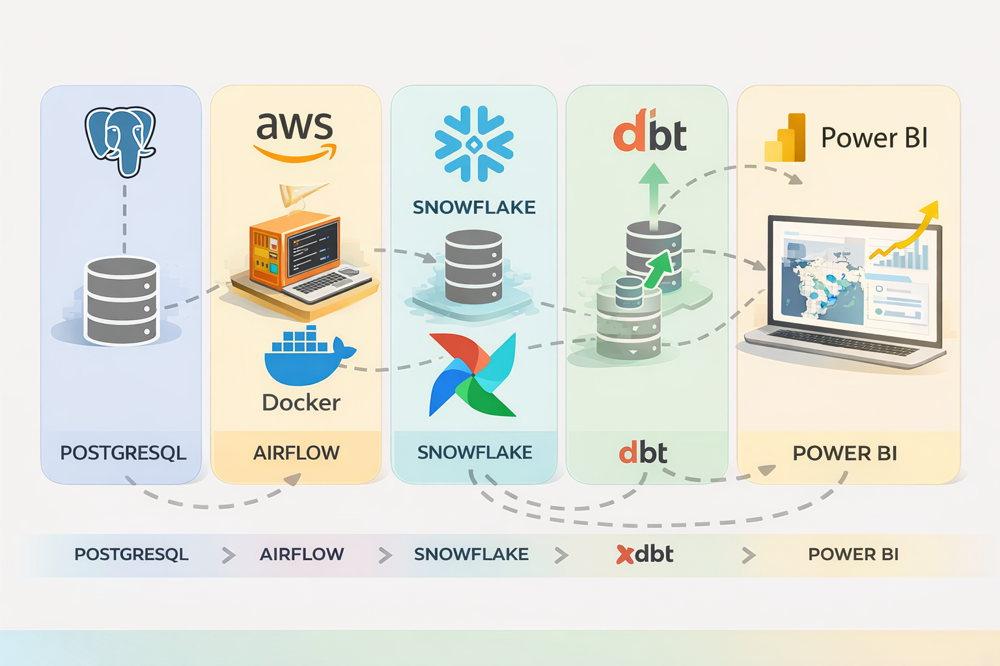

# NovaDrive Motors – Data Engineering Pipeline

## 📌 Overview
Este projeto implementa um pipeline completo de engenharia de dados,
simulando um ambiente real de uma montadora de veículos, com ingestão,
orquestração, modelagem analítica e visualização de dados.

## 🏗️ Arquitetura
PostgreSQL → Airflow (Docker + EC2) → Snowflake → dbt → Power BI

## 🔄 Pipeline
- Ingestão incremental a partir do PostgreSQL
- Orquestração com Apache Airflow
- Carga na camada STAGE do Snowflake
- Transformações com dbt (stage, dimensions, facts)
- Consumo analítico via Power BI

## 🧰 Stack
- AWS EC2 (Ubuntu)
- Docker & Docker Compose
- Apache Airflow
- PostgreSQL
- Snowflake
- dbt
- Power BI

## 📊 Modelagem Analítica
- Dimensões: clientes, vendedores, veículos, concessionárias, estados, cidades
- Fato: vendas

## 🚀 Resultados
- Pipeline incremental automatizado
- Data Warehouse analítico
- Dashboards executivos prontos para tomada de decisão

## 👤 Autor
Elivelton Neves de Alcântara  
Data Engineer | Analytics Engineering
